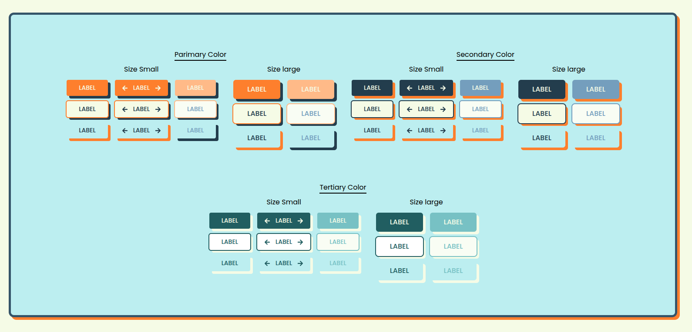

# components-ui-ready-brutalism

A premium collection of reusable, accessible, and highly customizable UI components built with **Next.js**, **TypeScript**, and **CVA**. Enhanced with `clsx` & `tailwind-merge` for seamless styling. Just copy, paste, and ship!



## 🚀 About the Project

This project is designed for developers looking for ready-to-use **Neo-Brutalism** UI components that they can easily copy and paste. No complex library installations required—simply grab the code you need, customize it, and drop it straight into your project.

> 💡 **Roadmap:** Currently, the component collection is limited, but this repository will be continuously updated with many more diverse and exciting UI components in the future!

---

## 🛠️ Tech Stack & Dependencies

This project is built using modern frontend technologies:
* **Framework:** Next.js 16 (React 19)
* **Styling:** Tailwind CSS v4
* **Utilities:** Class Variance Authority (CVA), clsx, & tailwind-merge

---

## 📦 Getting Started

### 1. Clone & Install Dependencies
Make sure you are using **pnpm** as your package manager:

```bash
# Install dependencies
pnpm install

# Run the development server
pnpm dev


2. Setup Utility Helper (cn)

The components in this project combine clsx and tailwind-merge to handle dynamic, conditional classes seamlessly without any style conflicts.

It is highly recommended to create a utility helper file inside lib/utils.ts (or your preferred project structure) with the following code:

TypeScript
import { type ClassValue, clsx } from "clsx";
import { twMerge } from "tailwind-merge";

export function cn(...inputs: ClassValue[]) {
  return twMerge(clsx(inputs));
}

3. Tailwind v4 Configuration (Theme Setup)

Since this project utilizes Tailwind CSS v4, the custom Neo-Brutalism colors and shadows are defined directly inside your global CSS file using the @theme directive.

Add the following variables to your main CSS file (e.g., app/globals.css):

CSS
@theme {
  /* custom color: tangerine */
  --color-tangerine-900: #fe7f2d;
  --color-tangerine-800: #ff9147;
  --color-tangerine-700: #ff9e5d;
  --color-tangerine-600: #ffac72;
  --color-tangerine-500: #ffba88;
  --color-tangerine-400: #ffc99f;
  --color-tangerine-300: #ffd8b7;
  --color-tangerine-200: #ffe8d1;
  --color-tangerine-100: #fff5eb;

  /* custom color: denim */
  --color-denim-900: #233d4d;
  --color-denim-800: #355469;
  --color-denim-700: #486c85;
  --color-denim-600: #5d85a1;
  --color-denim-500: #749ebd;
  --color-denim-400: #92b8d4;
  --color-denim-300: #b3d1ea;
  --color-denim-200: #d6e8f5;
  --color-denim-100: #f0f6fa;

  /* custom color: teal */
  --color-teal-900: #215e61;
  --color-teal-800: #337679;
  --color-teal-700: #468f92;
  --color-teal-600: #5da8ab;
  --color-teal-500: #77c1c4;
  --color-teal-400: #97d9dc;
  --color-teal-300: #bceef0;
  --color-teal-200: #ddf7f8;
  --color-teal-100: #f2fafb;

  /* custom color: linen */
  --color-linen-900: #f5fbe6;
  --color-linen-800: #f7fcf0;
  --color-linen-700: #f9fdf4;
  --color-linen-600: #fafef7;
  --color-linen-500: #fbfefa;
  --color-linen-400: #fcfffc;
  --color-linen-300: #fdfffd;
  --color-linen-200: #fefffe;
  --color-linen-100: #ffffff;

  /* custom shadow */
  --shadow-drop-tangerine: 6px 6px 0px 0px #fe7f2d;
  --shadow-drop-denim: 6px 6px 0px 0px #233d4d;
  --shadow-drop-teal: 6px 6px 0px 0px #215e61;
  --shadow-drop-linen: 6px 6px 0px 0px #f5fbe6;
}

Once added, you can immediately start using utility classes like bg-tangerine-900 or shadow-drop-denim across your components!

Made by Heri Hermansyah